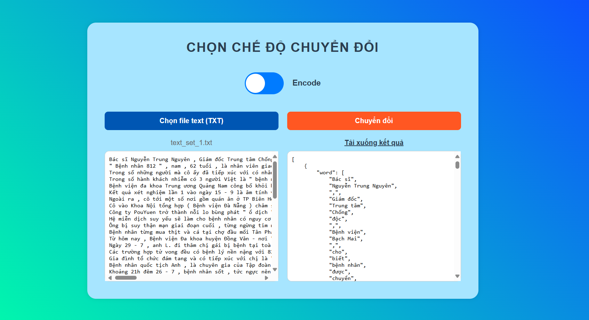
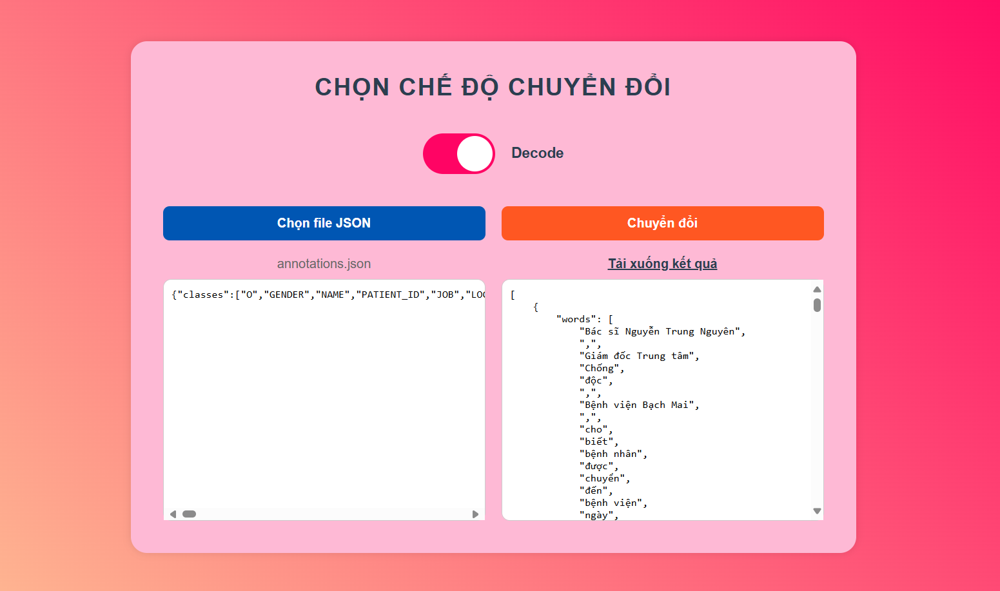
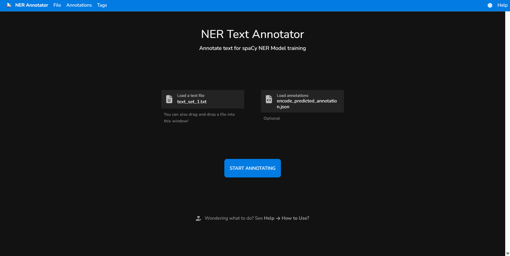
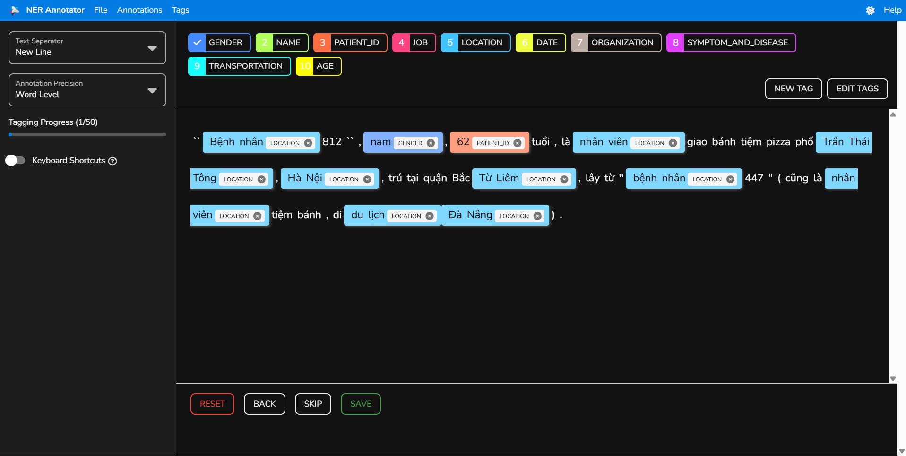

# 🔤 Encode–Decode Annotation Tool

Ứng dụng web đơn giản để:
- **Encode**: Dự đoán nhãn từ file text sử dụng mô hình CRF và chuyển đổi định dạng phù hợp với web annotate.
- **Decode**: Chuyển đổi định dạng annotations từ dạng web (được mã hóa vị trí từ) về dạng (word,tag) để đánh giá.

## 📁 Cấu trúc thư mục

```
TOOL/
├── static/
│   ├── encode_decode.html   # Giao diện người dùng
│   ├── script.js            # Logic gửi file & xử lý kết quả
│   └── styles.css           # CSS cơ bản
├── crf_model.pkl            # Mô hình CRF đã huấn luyện
├── server.py                # FastAPI backend
├── requirements.txt         # Danh sách thư viện cần cài
└── venv/                    # Môi trường ảo Python (sẽ tạo sau)
```

---

## ✅ Cài đặt & chạy ứng dụng

### 1. Clone git về máy

```bash
git clone https://github.com/PHTLing/Annotation_Tool.git
```
### 2. Tạo môi trường ảo

```bash
python -m venv venv
```

Kích hoạt:

- **Windows**:
  ```bash
  venv\Scripts\activate
  ```

- **Linux / macOS**:
  ```bash
  source venv/bin/activate
  ```

---

### 3. Cài thư viện cần thiết

```bash
pip install -r requirements.txt
```

---

### 4. Chạy server

```bash
python server.py
```

Mặc định chạy tại: [http://localhost:8000](http://localhost:8000), có thể dùng [http://127.0.0.1:8000/docs](http://127.0.0.1:8000/docs) để test với Swagger UI

---

### 5. Mở giao diện

Chạy xong server, mở file sau trong trình duyệt:

```
static/encode_decode.html
```

> (Có thể mở trực tiếp bằng `file://` hoặc dùng Live Server trong VSCode.)

---

## 🧠 Chức năng

### 🟢 Encode

- Upload file `.txt` chứa câu cần gán nhãn.
- Server dự đoán nhãn cho từng từ bằng mô hình CRF.
- Trả về danh sách `word + tag` dưới dạng JSON.
- Kết quả hiển thị trực tiếp trên web.

### 🟡 Decode

- Chuyển đổi file annotation từ định dạng đã mã hóa vị trí từ (vị trí bắt đầu của từ, vị trí kết thúc của từ, nhãn) về dạng mặc định (từ, nhãn) để đánh giá.

---

## 🛠 Yêu cầu môi trường

- Python 3.8+
- Môi trường được cài đặt đầy đủ các thư viện
- Đã train và lưu `crf_model.pkl` dùng `sklearn_crfsuite`

---

## 📦 Thư viện sử dụng

- `fastapi`
- `uvicorn`
- `joblib`
- `underthesea`
- `python-multipart`
- `scikit-learn`
- `sklearn_crfsuite`

---

## 🌐 Công cụ hỗ trợ Annotate 

Sử dụng công cụ annotate tại:

🔗 [https://arunmozhi.in/ner-annotator/](https://arunmozhi.in/ner-annotator/)

Trang web này cho phép bạn:
- Nhập hoặc dán văn bản để annotate nhãn thực thể
- Xuất file kết quả annotation (dạng JSON)

---

## 🔄 Quy trình sử dụng công cụ Encode–Decode

1. **Encode**  
   - Tải lên file `.txt` chứa văn bản cần xử lý tại web encode.  
   - Hệ thống dự đoán nhãn và xuất ra file JSON (`encode_predicted_annotation.json`).

2. **Gán nhãn thủ công (Annotate)**  
   - Truy cập trang: [https://arunmozhi.in/ner-annotator/](https://arunmozhi.in/ner-annotator/)  
   - Upload:
     - File `.txt` (văn bản gốc)
     - File `encode_predicted_annotation.json` (kết quả encode)
   - Thực hiện chỉnh sửa/gán nhãn bằng cách chọn cụm từ và gán nhãn phù hợp.

3. **Export annotation**  
   - Sau khi hoàn tất, xuất kết quả thành file `annotations.json`.

4. **Decode (Xử lý & đánh giá)**  
   - Đưa file `annotations.json` vào web decode để:
     - Chuyển đổi về định dạng chuẩn
     - Phục vụ cho việc đánh giá kết quả gán nhãn 

---

## 📸 Hình ảnh minh họa

| Giao diện Encode sau khi xử lý xong |
|------------------|
|  |

| Giao diện Decode sau khi xử lý xong |
|--------------|
|  |

| Giao diện Upload của annotation tool |
|------------------|
|  |

| Giao diện gán nhãn  của annotation tool |
|------------------|
|  |
---
